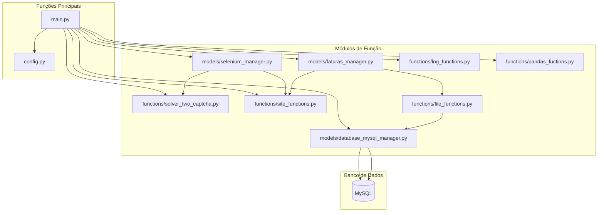

# Projeto: Automação de Download de Faturas COMPESA

Este projeto realiza a automação do processo de login, navegação e download de faturas do site da COMPESA, utilizando Selenium, integração com banco de dados MySQL e tratamento de CAPTCHAs via TwoCaptcha.

---

## Panorama Geral

O objetivo é automatizar a coleta de faturas de água para diferentes clientes, realizando login no site da COMPESA, navegando até a unidade consumidora (UC), baixando as faturas disponíveis e registrando logs e status no banco de dados.

Principais funcionalidades:
- Leitura dos dados de login e UC do banco de dados.
- Automatização do acesso ao site da COMPESA via Selenium.
- Resolução automática de CAPTCHAs.
- Download e organização dos arquivos PDF das faturas.
- Registro de logs e status das operações.
- Tratamento de erros e exceções.

---

## Fluxograma dos Módulos

---

## Caminho do Fluxo

1. **main.py**  
   - Carrega configurações e variáveis de ambiente (`config.py`).
   - Conecta ao banco de dados e lê os dados de login/UC via `Manage_database`.
   - Ajusta o DataFrame de login (`pandas_fuctions.py`).
   - Para cada registro:
     - Inicializa o Selenium (`Selenium_manager`).
     - Resolve o CAPTCHA (`solver_two_captcha.py`).
     - Realiza login e navegação até a UC (`site_functions.py`).
     - Instancia o gerenciador de faturas (`Faturas_manager`).
     - Verifica e baixa faturas disponíveis.
     - Move e renomeia PDFs baixados (`file_functions.py`).
     - Registra logs das operações (`log_functions.py`).
     - Atualiza status no banco de dados.

2. **models/database_mysql_manager.py**  
   - Gerencia operações de leitura e escrita no banco de dados.

3. **models/selenium_manager.py**  
   - Inicializa e configura o Selenium WebDriver.
   - Gerencia navegação e captura de elementos.

4. **models/faturas_manager.py**  
   - Extrai informações de faturas do HTML.
   - Realiza download e movimentação dos arquivos.

5. **functions/solver_two_captcha.py**  
   - Resolve CAPTCHAs de imagem usando a API TwoCaptcha.

6. **functions/site_functions.py**  
   - Funções para login, navegação e interação com elementos dinâmicos do site.

7. **functions/log_functions.py**  
   - Criação e registro de logs das operações.

8. **functions/pandas_fuctions.py**  
   - Ajuste e extração de dados do DataFrame de login.

9. **functions/file_functions.py**  
   - Movimentação, renomeação e verificação de arquivos PDF das faturas.

---

## Observações

- O projeto utiliza variáveis de ambiente para credenciais e configurações sensíveis.
- O fluxo é robusto para lidar com erros de conexão, login e download.
- Os logs são salvos em arquivo Excel para auditoria e acompanhamento.

---